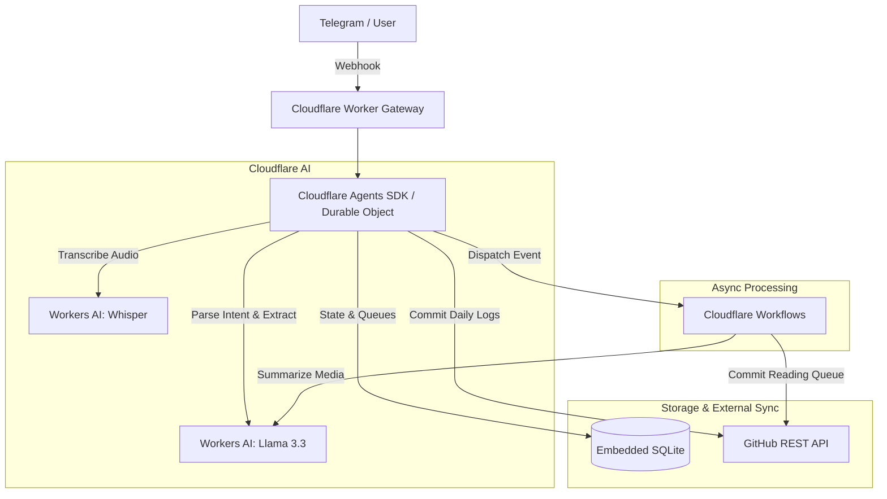

# Cloudflare AI Personal Assistant (Study Agent)

An autonomous, serverless AI companion designed to eliminate friction in personal tracking, content ingestion, workout logging, and daily planning. It acts as an intelligent orchestration layer between Telegram and a private GitHub knowledge repository.

This project demonstrates a production-grade serverless AI stack using 100% Cloudflare infrastructure.

## Architecture Diagram



## Architecture & Cloudflare Stack

- **Cloudflare Workers**: The core gateway handling Telegram webhooks and routing.
- **Workers AI**: Powers intent classification, structured data extraction (via Llama 3.3 70B), and audio transcription (Whisper).
- **Cloudflare Agents SDK (Durable Objects)**: Maintains stateful, singleton memory per user with embedded SQLite to handle queues, alarms, and conversational context.
- **Cloudflare Workflows**: Orchestrates resilient, multi-step asynchronous tasks like media ingestion, URL scraping, and summarization.

## Key Features

1. **Voice & Free-Text Workout Logging**: Send an audio memo to the bot from the gym; Whisper transcribes it, Llama structures the sets/reps into JSON, and the Durable Object commits it to GitHub.
2. **Media & Reading Queue ("Drop & Forget")**: Share a YouTube or article URL to the bot. A Cloudflare Workflow takes over to scrape, categorize, estimate read time, and append it to a reading queue markdown file.
3. **Ambient Check-Ins**: Uses Durable Object alarms to ping the user contextually based on the time of day and recent GitHub commit activity.
4. **Dynamic Rescheduling**: Natural language understanding (e.g., "Working late today") updates the SQLite state to snooze alarms and adjust daily tracking without creating a backlog of missed tasks.

## Local Development

```bash
# 1. Install dependencies
npm install

# 2. Run the local dev server
npm run dev
```

> **Note:** External integrations (Telegram, GitHub API, Google AI Studio fallback) require secrets configured via `wrangler secret put` or a local `.dev.vars` file.
