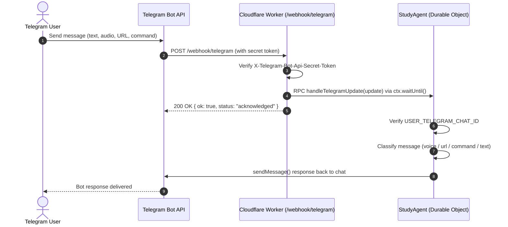

# Phase 2: Telegram Gateway, Security Layer & Agent Routing — Implementation Guide

> **Phase Goal:** Connect the Cloudflare Worker to the Telegram Bot API, authenticate inbound webhooks with secret tokens, enforce single-user access control, route updates via RPC to the `StudyAgent` Durable Object, and establish initial intent dispatching.

---

## 1. Overview & Architecture

In Phase 2, the edge Worker acts as a fast webhook gateway, offloading all stateful handling to the `StudyAgent` Durable Object:



---

## 2. Configuration & Secrets

The following environment variables and secrets were configured in both local `.dev.vars` and remote Cloudflare Workers secrets (`npx wrangler secret put`):

| Variable | Description | Security / Scope | Status |
|---|---|---|---|
| `TELEGRAM_BOT_TOKEN` | Bot API token issued by `@BotFather` | Worker Secret | Configured |
| `TELEGRAM_SECRET_TOKEN` | High-entropy string sent in `X-Telegram-Bot-Api-Secret-Token` | Worker Secret | Configured |
| `USER_TELEGRAM_CHAT_ID` | Owner Telegram chat ID for single-user authorization | Worker Secret | Configured |

---

## 3. Sub-Steps & Execution Details

### Step 2.1: Webhook Endpoint & Header Validation (`src/index.ts`)
- Defined route `POST /webhook/telegram`.
- Validates the `X-Telegram-Bot-Api-Secret-Token` request header against `env.TELEGRAM_SECRET_TOKEN`.
- In local development (`.dev.vars` empty), logs a warning and proceeds for testing flexibility.
- Returns `401 Unauthorized` if token mismatch occurs in production.
- Uses `ctx.waitUntil(agent.handleTelegramUpdate(update))` to acknowledge Telegram within < 100ms and prevent webhook timeout retries.

### Step 2.2: Telegram Client Wrapper (`src/telegram/bot.ts`)
- Built `TelegramClient` utility class with zero external dependencies using native Worker `fetch`:
  - `sendMessage(chatId, text, parseMode)`: Sends HTML or Markdown formatted responses.
  - `getFileDownloadUrl(fileId)`: Resolves Telegram `file_id` to download URL for audio/voice stream ingestion.

### Step 2.3: Access Control & Intent Routing in Durable Object (`src/agent.ts`)
- Implemented `handleTelegramUpdate(update)` inside `StudyAgent`:
  - **Access Guard:** Validates `message.chat.id` matches `env.USER_TELEGRAM_CHAT_ID`. Drops and logs any unauthorized updates.
  - **Intent Dispatcher Skeleton:**
    - `message.voice`: Detects voice note `file_id` for multimodal transcription (Phase 4).
    - `text.startsWith("http")`: Detects URLs for article extraction workflow (Phase 5).
    - `text.startsWith("/")`: Detects bot commands (e.g. `/log`, `/status`, `/snooze`).
    - General text: Captures study/workout quick logs for LLM parsing.

### Step 2.4: Webhook Registration & Live Verification
- Deployed worker to production: `https://study-agent.sangamkumar2000.workers.dev`.
- Registered webhook with Telegram Bot API:
  ```bash
  curl -X POST "https://api.telegram.org/bot<TELEGRAM_BOT_TOKEN>/setWebhook" \
       -H "Content-Type: application/json" \
       -d '{"url":"https://study-agent.sangamkumar2000.workers.dev/webhook/telegram","secret_token":"<TELEGRAM_SECRET_TOKEN>"}'
  ```
- **Validation:** Live messages sent from Telegram client received instant acknowledgments and category-specific stub replies:
  - Text messages receive text log acknowledgment.
  - Voice notes receive audio acknowledgment.
  - Links receive URL workflow acknowledgment.
  - Slash commands receive command acknowledgment.

---

## 4. Current Status: Completed

All objectives of Phase 2 (Gateway, Security, Routing, and Live Deployment) are verified. Ready to proceed to **Phase 3: Durable Object Agent & SQLite State Layer**.
