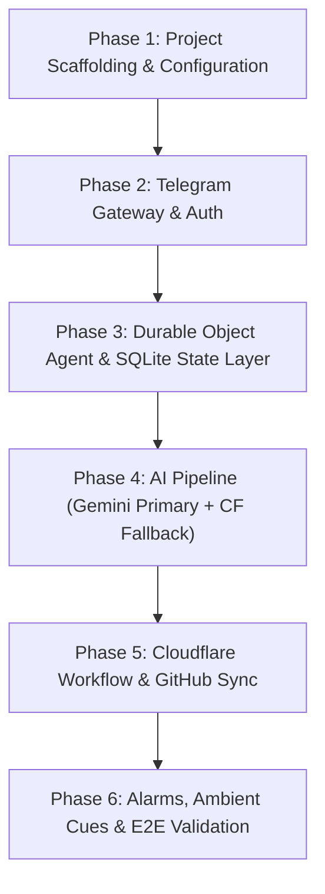

# Cloudflare AI Personal Assistant (`study-agent`) — Implementation Plan

> **Target Platform:** Cloudflare Workers, Cloudflare Agents SDK, Workers AI / Google Gemini, Cloudflare Workflows, Durable Objects (SQLite)  
> **Repository:** `study-agent`  
> **Target Sink:** `sangam-kumar/study-repo`  
> **Development Environment:** Native Windows (PowerShell) + Node v24  

---

## 1. Architectural Decisions & Trade-Offs

### 1.1 Development Environment: Native Windows (PowerShell)
* **No Virtualization Overhead:** Node v24.11.0, npm 11.6.1, and Wrangler v4.147.0 are installed directly on Windows.
* **Elimination of WSL 9P Latency:** Working on `C:\study\study-agent` directly in Windows avoids WSL cross-mount performance degradation on `npm install` and file watchers.
* **Cloudflare `workerd`:** Fully supported native Windows binary for local emulation.

### 1.2 LLM Engine: Pluggable Gemini & Workers AI
* **Primary LLM:** Google Gemini (Gemini 1.5 Flash / 2.0 Flash) via Google AI Studio API.
  * Free tier: 15 RPM, 1M tokens/min, 1,500 requests/day.
  * Superior reasoning, strict JSON structured schema output, and native audio processing.
* **Secondary / Portfolio Fallback:** Cloudflare Workers AI (`@cf/meta/llama-3.3-70b-instruct` and `@cf/openai/whisper`).
* **Design:** Clean LLM interface (`src/ai/provider.ts`) allowing runtime switching via environment variable (`LLM_PROVIDER=gemini` or `cloudflare`).

### 1.3 Audio Handling: Zero Storage Stream
* Audio notes are **never stored** on Cloudflare, SQLite, or disk:
  1. Telegram delivers audio update (`file_id`).
  2. Worker streams audio buffer into memory via Telegram `getFile`.
  3. Audio buffer passed to Gemini (multimodal) or Whisper (Workers AI) for transcription and structured JSON extraction in a single pass.
  4. Memory buffer is immediately garbage collected. Only structured text/JSON is persisted.

### 1.4 Scheduling: Unlimited Reminders via Durable Object Alarms
* Cloudflare free cron triggers have a limit of 3–5 cron expressions in configuration.
* **Solution:** We use **Durable Object Alarms (`this.ctx.storage.setAlarm`)**, which are **unlimited** and free:
  * Reminders are stored in SQLite (`reminders` table).
  * The Durable Object sets an alarm for the earliest upcoming timestamp.
  * When `alarm()` fires, it triggers the cue (08:15 IST, 17:00 IST, 21:30 IST, or ad-hoc custom alarms) and automatically sets the alarm for the next item.

---

## 2. Dependencies & Tooling

### Runtime & CLI Tools
* **Node.js:** v24.11.0 (verified)
* **npm:** 11.6.1 (verified)
* **Cloudflare Wrangler CLI:** `wrangler@^4.147.0` (verified)
* **Local Webhook Tunnel:** `cloudflared` (native Cloudflare tunnel) or `ngrok`

### Project Dependencies (`package.json`)
* **Core Cloudflare Runtime:**
  * `agents-sdk`: Cloudflare Agents SDK for Durable Objects, SQLite persistence, and state.
  * `@cloudflare/workers-types`: TypeScript definitions for Workers, Workflows, Durable Objects.
  * `typescript`: Type checking and compilation.
* **AI & External APIs:**
  * `@google/genai` (or lightweight zero-dependency fetch client for Gemini API).
  * Telegram Webhook types / helper client.
  * Lightweight GitHub REST client using native Workers `fetch`.

### Required Credentials & Secrets

| Variable | Source | Purpose | Phase Needed |
|---|---|---|---|
| `GEMINI_API_KEY` | Google AI Studio | Gemini 1.5/2.0 Flash inference & audio parsing | Phase 4 |
| `TELEGRAM_BOT_TOKEN` | Telegram `@BotFather` | Authenticating Telegram Bot API calls | Phase 2 |
| `TELEGRAM_SECRET_TOKEN` | Random secure string | Validating incoming Telegram webhook requests | Phase 2 |
| `USER_TELEGRAM_CHAT_ID` | Telegram User ID | Access control (single-user authorization) | Phase 2 |
| `GITHUB_PAT` | GitHub Settings (Tokens) | Fine-grained PAT with `contents:write` on `study-repo` | Phase 5 |
| `GITHUB_REPO` | Config (`sangam-kumar/study-repo`) | Target repository for markdown commits | Phase 5 |
| `CLOUDFLARE_API_TOKEN` | Cloudflare Dashboard / CLI | Deployment to Cloudflare edge | Phase 6 |

---

## 3. Implementation Workflow Protocol

To ensure small, solidified, easily chunkable steps:
1. **Phase Implementation Doc:** Prior to executing any phase, create a specific phase guide (`docs/phase-X-<name>.md`) breaking down tasks into discrete sub-steps with exact validation checks.
2. **Step-by-Step Execution:** Execute one discrete sub-step at a time.
3. **Logistics & Pre-Flight Validation:** Confirm required tokens, environment variables, and network connectivity before writing code that depends on them.
4. **Testing & Solidification:** Verify each sub-step before advancing to the next.
5. **Living Plan Sync:** Update this master plan whenever design adaptations occur.

---

## 4. Master Phased Roadmap

### Phase 1: Project Scaffolding & Configuration (Completed)
* **Phase Doc:** `docs/phase-1-scaffolding.md`
* **Sub-steps:**
  - [x] 1.1: Initialize `package.json` with scripts and core dependencies.
  - [x] 1.2: Configure `tsconfig.json` for Cloudflare Workers & modern ESNext.
  - [x] 1.3: Configure `wrangler.jsonc` (bindings for Durable Objects + SQLite, Workflows, Assets/AI).
  - [x] 1.4: Set up folder structure and stub entrypoint files.
  - [x] 1.5: Validate compilation via `npm run typecheck` and `npx wrangler types`.

### Phase 2: Telegram Gateway & Security Layer (Completed)
* **Phase Doc:** `docs/phase-2-telegram.md`
* **Logistics Check:** Verified `TELEGRAM_BOT_TOKEN`, `TELEGRAM_SECRET_TOKEN`, `USER_TELEGRAM_CHAT_ID`.
* **Sub-steps:**
  - [x] 2.1: Implement webhook endpoint with `X-Telegram-Bot-Api-Secret-Token` validation.
  - [x] 2.2: Add chat ID access-control guard.
  - [x] 2.3: Build lightweight Telegram API client (`sendMessage`, `getFile`).
  - [x] 2.4: Live deployment and webhook verification with Telegram Bot API.

### Phase 3: Durable Object Agent & SQLite State Layer (Completed)
* **Phase Doc:** `docs/phase-3-durable-object.md`
* **Sub-steps:**
  - [x] 3.1: Define embedded SQLite schema (`bot_state`, `interaction_logs`, `reading_queue`, `workout_logs`, `reminders`) in `src/db/schema.ts`.
  - [x] 3.2: Implement `StudyAgent.onStart()` SQLite initialization and migration.
  - [x] 3.3: Implement typed CRUD operations and dynamic snooze handlers (`snooze_until`, `clearSnooze`).
  - [x] 3.4: Wire Telegram updates to `interaction_logs` & implement state inspection commands (`/status`, `/queue`, `/snooze`, `/unsnooze`, `/recent`).

### Phase 4: AI Pipeline (Gemini Primary + CF Fallback)
* **Phase Doc:** `docs/phase-4-ai-pipeline.md`
* **Logistics Check:** Verify `GEMINI_API_KEY`.
* **Sub-steps:**
  - 4.1: Build generic `LLMProvider` interface.
  - 4.2: Implement Gemini provider with structured JSON extraction (intent, workout parsing, URL categorization).
  - 4.3: Implement in-memory audio-to-JSON handling (zero disk storage).
  - 4.4: Implement Workers AI fallback provider.
  - 4.5: Validation using sample workout voice transcript & URL inputs.

### Phase 5: Cloudflare Workflow & GitHub Sync
* **Phase Doc:** `docs/phase-5-workflow-github.md`
* **Logistics Check:** Verify `GITHUB_PAT` and `GITHUB_REPO` permissions.
* **Sub-steps:**
  - 5.1: Build lightweight GitHub REST client (`getFileContent`, `commitFile`, `getTodayCommits`).
  - 5.2: Implement `MediaIngestionWorkflow` (scrape URL -> categorize -> commit to `study/reading/reading-queue.md`).
  - 5.3: Implement workout commit handler (`life/fitness.md`).
  - 5.4: Test sandbox commit against `study-repo`.

### Phase 6: Alarms, Ambient Cues & End-to-End Validation
* **Phase Doc:** `docs/phase-6-alarms-e2e.md`
* **Sub-steps:**
  - 6.1: Implement `alarm()` handler for dynamic scheduled cues (08:15 IST morning cue, 17:00 IST commute read, 21:30 IST evening synthesis).
  - 6.2: Implement ad-hoc reminder scheduler (arbitrary future reminders).
  - 6.3: End-to-end testing with local tunnel (`cloudflared`).
  - 6.4: Documentation & GitHub Actions deployment workflow.
